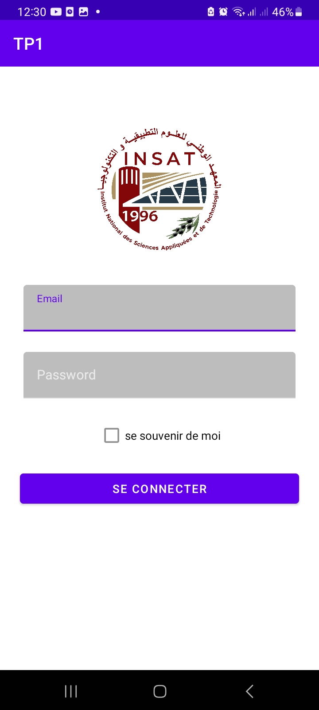
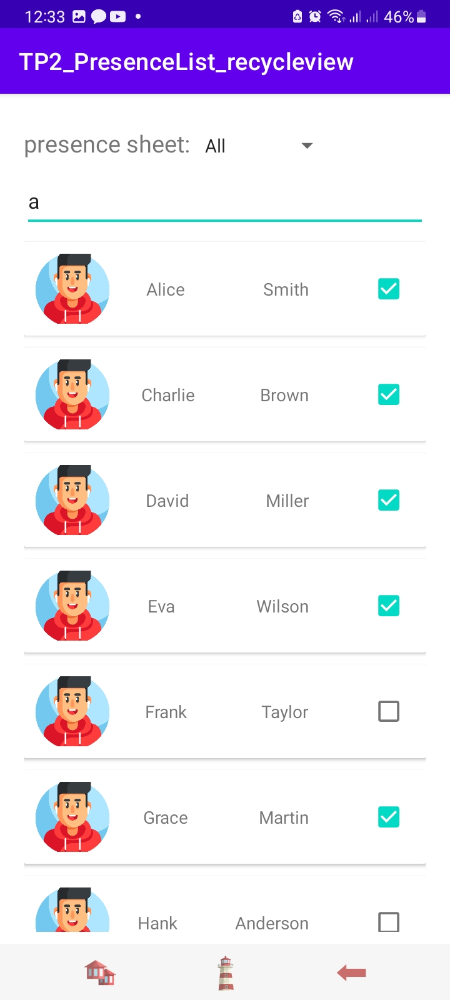
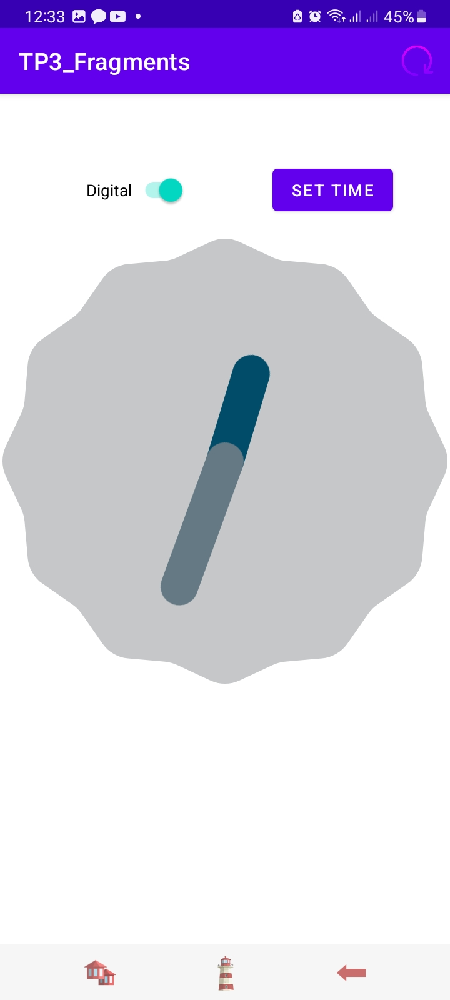
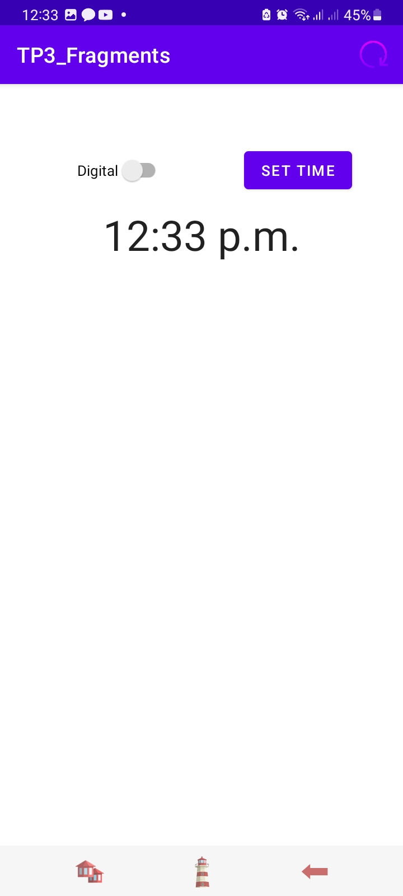
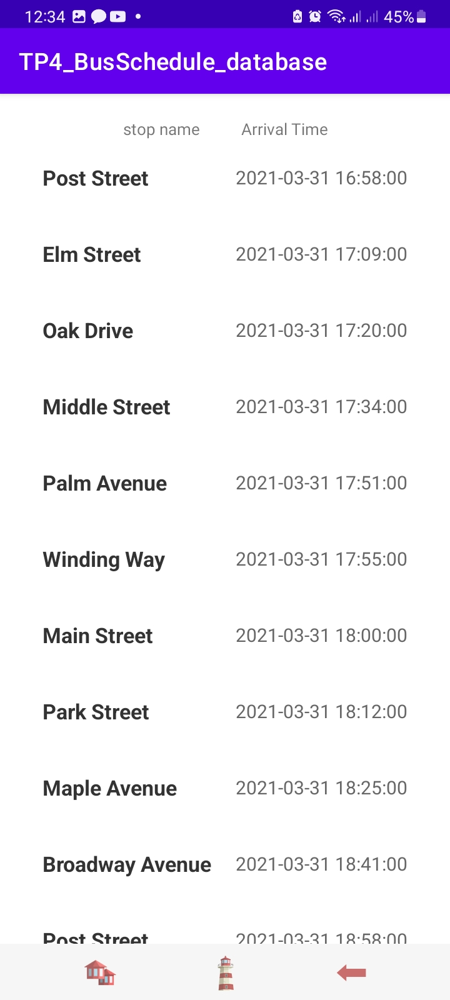
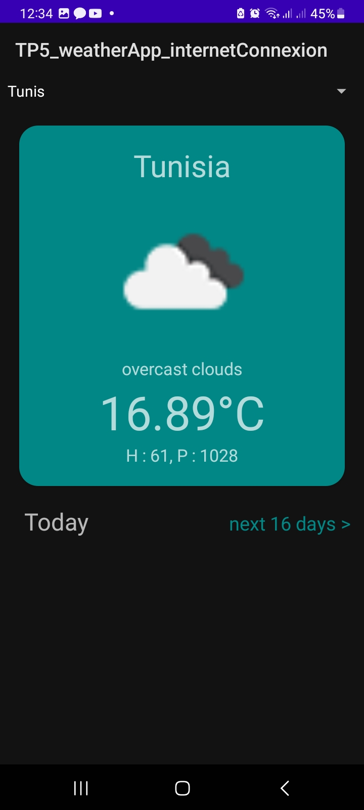
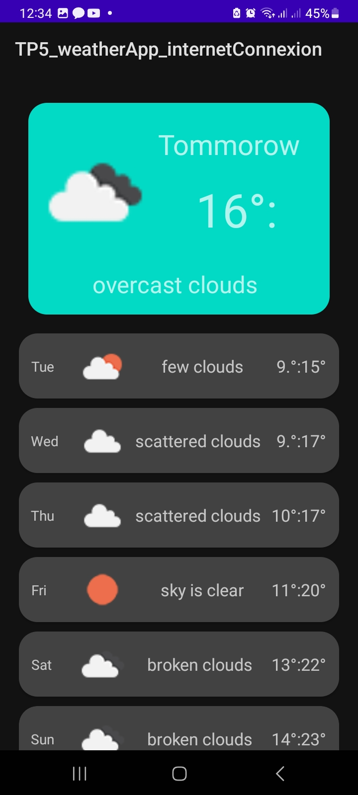

# Kotlin Workshop Repository

Welcome to the Kotlin Workshop repository! This repository contains materials and projects for a comprehensive Kotlin workshop. Each directory corresponds to a different session of the workshop, covering various aspects of Kotlin Android development.

## Table of Contents

1. [Introduction to the Kotlin Language](./TP0_Kotlin_Initiation)
2. [Creating Graphical Interfaces and Navigation](./TP1_graphicalInterface_navigation)
3. [A Simple Interface to Order Pizza](./Kotlin1_OrderPizza)
4. [Advanced Graphical Elements - RecyclerView](./TP2_PresenceList_recycleview)
5. [Creating Fragments](./TP3_Fragments)
6. [Data Storage and Firebase](./TP4_BusSchedule_database)
7. [Connecting to RESTful Web Services](./TP5_weatherApp_internetConnexion)

## Workshop Sessions

### TP0: Introduction to the Kotlin Language

This session was an introduction to the Kotlin programming language, covering its basic syntax, features, and concepts.

### TP1: Creating Graphical Interfaces and Navigation

create graphical interfaces and implement navigation within Kotlin Android application using intents.

### kotlin1_orderpizza

create a simple user interface for ordering pizza.

### TP2: Advanced Graphical Elements - RecyclerView

Dive into advanced graphical elements, focusing on the RecyclerView component.
make a presence app 

### TP3: Creating Fragments

Understand the concept of fragments in Android development.
create fragments in Kotlin app.

### TP4: Data Storage and Firebase

Explore data storage options and integrate an sqlite database into Kotlin Android app to store and retrieve data.

### TP5: Connecting to RESTful Web Services

connect to RESTful web services. This session covers the basics of networking and how to interact with external APIs.
keywords(MVVM, Retrofit)

## Screenshots

    
    
    
    
    
    
    

